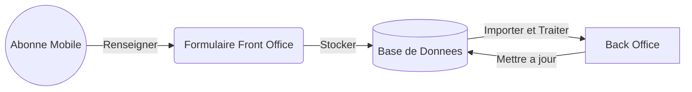

<br/><br/><br/>


# Projet d'identification des abonnés mobile ONECI

## Description

Le **projet** a pour but de permettre à l'**ONECI** de pouvoir **identifier** les **abonnés** des **opérateurs télécoms** à travers un **formulaire** ayant pour but de **collecter les données** et un **Back office** permettant d'effectuer le **traitement** des **données collectées**.



## Choix des technologies d'implémentation

|         Spécifications        |FRONT END (Navigateur Client)|BACK END (Serveur ONECI)|
|-------------------------------|-----------------------------|------------------------|
|**Language de développement**  |`HTML` `CSS` `JavaScript`    |`PHP`                   |
|**Framework**                  |`jQuery` `Vue.JS`            |`Laravel`               |
|**Gestionnaire de dépendances**|`NPM`                        |`Composer`              |
|**Base de données**            |`Cookies` `Cache`            |`MariaDB`               |

## Pré-réquis

Pour pouvoir exécuter le code source du projet, assurez vous de pouvoir disposer des outils suivants :
- `PHP >=7.4.9`
- [`Composer >=2.3.9`](https://getcomposer.org/download/)
- [`NodeJS >=14.18.1`](https://nodejs.org/en/download/)
- [`NPM >=6.14.15`](https://www.npmjs.com/)

## Initialisation du projet

Ouvrir votre **terminal** ou **invite de commande** `cmd`, allez à la racine du projet et exécutez les commandes suivantes :

<br/>

- Installation toutes les dépendances PHP permettant au projet de pouvoir fonctionner convenablement :
```console
composer install
```
- Installation toutes les dépendances Javascript permettant au projet de pouvoir fonctionner convenablement :
```console
npm install
```
- Création du fichier `.env`
> *Dupliquer le fichier `.env.example` présent dans la racine du projet et renommer le fichier dupliqué avec le nom `.env` puis renseigner ce fichier en spécifiant les **paramètres de votre base de données** locale du projet*.
- Création des tables de la base de données du projet
```console
php artisan migrate
```
- Remplisage des tables de la base de données
```console
php artisan db:seed
```

<br/>

- Démarrage du serveur
```console
php artisan serve
```

<br/>

&copy; Copyright Office National de l'Etat Civil et de l'Identification - ONECI - Projet Privé - Tous droits réservés
