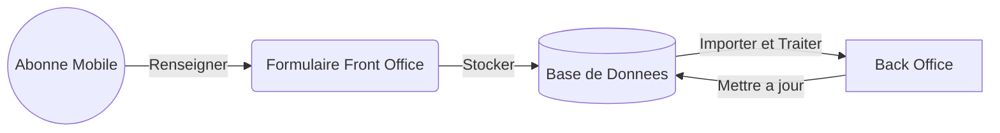

<br/><br/><br/>
<p align="center"></p>

<br/>

# Plateforme Identification Abonnés Mobile ONECI
### Code source du Projet d'identification des abonnés mobile de l'Office National de l'Etat Civil et de l'Identification de Côte d'Ivoire
[](https://app.travis-ci.com/oneci-dev/identification-abonnes-mobile)
[]()

<br/>

## Description

Le **projet** a pour but de permettre à l'**ONECI** de pouvoir **identifier** les **abonnés** des **opérateurs télécoms** à travers un **formulaire** ayant pour but de **collecter les données** et un **Back office** permettant d'effectuer le **traitement** des **données collectées**.



## Choix des technologies d'implémentation

|         Spécifications        |FRONT END (Navigateur Client)|BACK END (Serveur ONECI)|
|-------------------------------|-----------------------------|------------------------|
|**Language de développement**  |`HTML` `CSS` `JavaScript`    |`PHP`                   |
|**Framework**                  |`jQuery` `Vue.JS`            |`Laravel`               |
|**Gestionnaire de dépendances**|`NPM`                        |`Composer`              |
|**Base de données**            |`Cookies` `Cache`            |`MariaDB`               |

## Pré-réquis

Pour pouvoir exécuter le code source du projet, assurez-vous de pouvoir disposer des outils suivants :
- [](https://www.php.net/downloads.php)
- [](https://getcomposer.org/download/)
- [](https://nodejs.org/en/download/)
- [](https://www.npmjs.com/)
- [](https://mariadb.org/download/)

## Initialisation du projet

Ouvrir votre **terminal** ou **invite de commande** `cmd`, aller à la racine du projet et exécutez les commandes suivantes :
<br/>

- Installation de toutes les dépendances PHP permettant au projet de pouvoir fonctionner convenablement :
```console
composer install
```
- Installation de toutes les dépendances Javascript permettant au projet de pouvoir fonctionner convenablement :
```console
npm install
```
- Création du fichier `.env`
> *Dupliquer le fichier `.env.example` présent dans la racine du projet et renommer le fichier dupliqué avec le nom `.env` puis renseigner ce fichier en spécifiant les **paramètres de votre base de données** locale du projet*.
- Création d'une `APP_KEY`
```console
php artisan key:generate
```
- Création des tables de la base de données du projet
```console
php artisan migrate
```
- Remplisage des tables de la base de données
```console
php artisan db:seed
```

<br/>

- Démarrage du serveur
```console
php artisan serve
```

:blush: Enjoy !

<br/><br/>

*&copy; Copyright Office National de l'Etat Civil et de l'Identification - ONECI - Projet Privé - Tous droits réservés*
